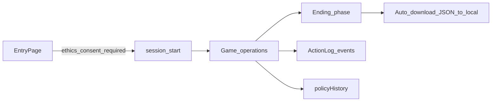

# frontend-new 操作ログ設計

本書は River Basin Adaptation Game（`frontend-new`）における操作ログの設計を固定する。用途はワークショップ研究分析であり、実装はこの文書のスキーマ・イベント辞書・保存方針・研究倫理 UI に従う。

---

## 1. 目的とスコープ

### 1.1 目的

各プレイヤーがいつ・どのような操作を行ったかを、後から集計・再現可能な形で記録する。最終結果画面到達時には、操作過程と結果要約をまとめた JSON を利用者端末へ自動保存する。

### 1.2 記録する粒度

UI の全クリックやマウス座標は取らない。次を中心に記録する。

- 研究倫理同意とセッション境界
- 政策スライダー変更とターン確定（Advance）
- 画面遷移・分析操作・住民インタビュー等の情報探索
- イベント／レポートの閉じ操作、比較画面、再開
- カメラ WebSocket 経由の政策入力（該当時）

### 1.3 初期スコープ外

- マウス座標の連続トラッキング、全 keydown、動画再生位置
- シミュレータ内部の年次乱数詳細（必要なら別ログ）
- カメラ映像そのものの保存

---

## 2. 既存資産との役割分担

| 種類 | 中身 | 既存／新規の置き場 | 操作過程を含むか |
|---|---|---|---|
| 操作ログ | 変更・閲覧・遷移・同意の時系列 | **新規**（クライアントイベント配列 → 最終 JSON） | はい |
| 結果ログ（確定政策） | 各ターンで確定したスライダー | `useSimulation` の `policyHistory` | いいえ（確定値のみ） |
| 結果ログ（年次指標） | 年次シミュレーション出力 | `useSimulation` の `history` | いいえ |
| グループ比較 | 最終スコアの共有ランキング | backend `comparison-results` / TSV | いいえ |
| 旧汎用ログ | 任意 JSON 追記 | backend `/ws/log` → `data/user_log.json` | 形式不定・frontend-new 未接続 |

### 2.1 `policyHistory` / `history`

- **できること**: 各 25 年ターンで確定した政策と、その結果の指標系列を再現する
- **できないこと**: スライダーを途中でどう動かし直したか、分析画面を見たか、同意の有無・時刻、画面滞在の順序

操作ログはこれらを補完する。分析時は `session_id` で結合する。最低限の政策再現性のため、`advance_cycle_click` の payload には確定スライダー一式を必ず含める。

### 2.2 `comparison-results`

最終評価到達時にサーバへ保存される他グループ比較用スコアである。操作過程は含まない。操作ログ JSON の `results.history_summary` とスコア定義は整合させるが、保存経路は別とする。

### 2.3 `/ws/log`（旧）

旧フロント想定の WebSocket ロガーで、受信オブジェクトを巨大な JSON 配列として毎回全書き込みする。競合・破損リスクが高く、スキーマも不定のため **frontend-new の主経路では採用しない**。将来サーババックアップが必要になった場合は、追記型の `POST /operation-logs`（JSONL）を別途検討する（本設計の必須要件ではない）。

### 2.4 カメラ用 `ws://localhost:3001`

政策スライダーの外部入力用であり、操作ログ用途ではない。値を UI に反映したときは操作ログ側で `camera_slider_update`（`source: "camera_ws"`）として記録する。



---

## 3. セッション識別子

プレイ開始（Entry で開始ボタン押下）時に発行し、最終 JSON の `session` オブジェクトおよび全イベントに付与する。

| フィールド | 型 | 意味 |
|---|---|---|
| `session_id` | string (UUID) | セッション一意 ID |
| `user_name` | string | Entry のユーザ名 |
| `team_name` | string | Entry のチーム名（空文字可） |
| `mode` | `"upstream"` \| `"downstream"` \| `"team"` | プレイモード |
| `rcp` | number | 選択 RCP |
| `ethics_consent` | boolean | 開始時点で必ず `true` |
| `ethics_consent_at` | string (ISO8601) | 同意チェックが入った時刻 |
| `client_started_at` | string (ISO8601) | セッション開始時刻 |
| `app_version` | string | `frontend-new` の `package.json` version |

---

## 4. 共通イベントスキーマ

プレイ中はクライアントメモリ上でイベント配列を蓄積する。各要素は次の共通形とする。

```json
{
  "schema_version": 1,
  "session_id": "550e8400-e29b-41d4-a716-446655440000",
  "seq": 12,
  "ts_client": "2026-09-08T13:00:00.123+09:00",
  "phase": "game",
  "cycle": 1,
  "year": 2026,
  "game_view": "simple",
  "event_type": "policy_slider_change",
  "source": "ui",
  "payload": {}
}
```

| フィールド | 説明 |
|---|---|
| `schema_version` | イベントスキーマ版。現状は `1` |
| `session_id` | セッション UUID |
| `seq` | セッション内の単調増加番号（時計ずれ対策の順序キー） |
| `ts_client` | クライアント時刻（ISO8601、可能ならタイムゾーン付き） |
| `phase` | `entry` \| `game` \| `consequence` \| `report` \| `ending` \| `comparison` |
| `cycle` | 意思決定サイクル番号（entry 中は `0` または `null`） |
| `year` | ゲーム内年（entry 中は開始予定年または `null`） |
| `game_view` | `simple` \| `detail` \| `analysis` 等。非 game では `null` 可 |
| `event_type` | 後述のイベント辞書のキー |
| `source` | `ui` \| `camera_ws` \| `system` |
| `payload` | イベント固有フィールドのみ |

---

## 5. イベント辞書

### 5.1 A. セッション境界（必須）

| event_type | 発火タイミング | payload 概要 |
|---|---|---|
| `ethics_consent_checked` | 同意チェック ON | `{ "label_key": "..." }` |
| `ethics_consent_unchecked` | 同意チェック OFF | `{ "label_key": "..." }` |
| `ethics_detail_opened` | 「詳細を見る」でモーダル表示 | `{}` |
| `ethics_detail_closed` | モーダルを閉じた | `{ "via": "close_button" \| "overlay" }` |
| `session_start` | シミュレーション開始成功時 | mode, rcp, user, ethics 等 |
| `session_end` | `ending` 到達時 | `{ "reason": "completed" }` 等 |
| `session_export` | ローカル JSON 保存を実行した時点 | ファイル名・成功可否 |
| `phase_enter` | フェーズ入場 | `{ "phase": "..." }` |
| `phase_leave` | フェーズ退場 | `{ "phase": "...", "next_phase": "..." }` |

### 5.2 B. 意思決定（必須・研究の核）

| event_type | 発火タイミング | payload 概要 |
|---|---|---|
| `policy_slider_change` | スライダー確定値変更後 | key, from, to, clamped |
| `policy_preview_open` | 政策プレビュー表示 | `{ "policy_key": "..." }` |
| `policy_preview_close` | プレビュー非表示 | `{ "policy_key": "..." }` |
| `advance_cycle_click` | Advance 押下（送信直前） | sliders 一式, budget |
| `advance_cycle_succeeded` | 25 年計算成功 | cycle, year_range |
| `advance_cycle_failed` | 25 年計算失敗 | error 要約 |

### 5.3 C. 情報探索（推奨）

| event_type | 発火タイミング | payload 概要 |
|---|---|---|
| `game_view_change` | TopBar のビュー切替 | `{ "from": "...", "to": "..." }` |
| `diagram_expand_open` | 図の拡大表示を開く | `{ "diagram": "system_dynamics"\|"policy_effects_table"\|"policy_impact_map", "policy_key"?: "...", "src": "..." }` |
| `diagram_expand_close` | 図の拡大表示を閉じる | 同上 |
| `analysis_axis_change` | 散布図軸変更 | `{ "axis": "x"\|"y", "key": "..." }` |
| `detail_indicator_select` | DetailPanel 指標選択 | `{ "indicator_key": "..." }` |
| `resident_interview_request` | 住民インタビュー要求 | `{ "persona_key": "...", "score": ... }` |
| `language_toggle` | JA/EN 切替 | `{ "from": "ja", "to": "en" }` |

### 5.4 D. 帰結・比較（推奨）

| event_type | 発火タイミング | payload 概要 |
|---|---|---|
| `consequence_dismiss` | イベント画面を進める | `{ "event_id": "...", "queue_index": n }` |
| `report_dismiss` | サイクル報告を閉じる | `{ "cycle": n }` |
| `comparison_open` | 比較画面へ | `{}` |
| `comparison_back` | 比較から ending へ戻る | `{}` |
| `restart` | 最初からやり直す | `{}` |

### 5.5 E. 外部入力（該当時）

| event_type | 発火タイミング | payload 概要 |
|---|---|---|
| `camera_slider_update` | カメラ WS 由来の値反映 | key, value（`source: "camera_ws"`） |

---

## 6. 主要イベントの payload 例

### 6.1 `ethics_consent_checked`

```json
{
  "schema_version": 1,
  "session_id": "550e8400-e29b-41d4-a716-446655440000",
  "seq": 1,
  "ts_client": "2026-09-08T12:59:50.000+09:00",
  "phase": "entry",
  "cycle": null,
  "year": null,
  "game_view": null,
  "event_type": "ethics_consent_checked",
  "source": "ui",
  "payload": {
    "label_key": "entry.ethics.consent"
  }
}
```

### 6.2 `session_start`

```json
{
  "schema_version": 1,
  "session_id": "550e8400-e29b-41d4-a716-446655440000",
  "seq": 3,
  "ts_client": "2026-09-08T13:00:00.000+09:00",
  "phase": "entry",
  "cycle": null,
  "year": null,
  "game_view": null,
  "event_type": "session_start",
  "source": "ui",
  "payload": {
    "user_name": "Suzuki",
    "team_name": "GroupA",
    "mode": "team",
    "rcp": 4.5,
    "ethics_consent": true,
    "ethics_consent_at": "2026-09-08T12:59:50.000+09:00",
    "app_version": "0.1.0"
  }
}
```

### 6.3 `policy_slider_change`

```json
{
  "schema_version": 1,
  "session_id": "550e8400-e29b-41d4-a716-446655440000",
  "seq": 20,
  "ts_client": "2026-09-08T13:05:12.400+09:00",
  "phase": "game",
  "cycle": 1,
  "year": 2026,
  "game_view": "simple",
  "event_type": "policy_slider_change",
  "source": "ui",
  "payload": {
    "policy_key": "planting_trees_amount",
    "from": 0,
    "to": 5,
    "requested": 7,
    "clamped": true,
    "available_budget_points": 10,
    "used_policy_points_after": 8
  }
}
```

`requested` は利用者入力値、`to` は `findAllowedPolicyPoints` 適用後の値。切捨てがなければ `clamped: false` かつ `requested === to`。

### 6.4 `advance_cycle_click`

```json
{
  "schema_version": 1,
  "session_id": "550e8400-e29b-41d4-a716-446655440000",
  "seq": 45,
  "ts_client": "2026-09-08T13:08:00.000+09:00",
  "phase": "game",
  "cycle": 1,
  "year": 2026,
  "game_view": "simple",
  "event_type": "advance_cycle_click",
  "source": "ui",
  "payload": {
    "sliders": {
      "planting_trees_amount": 5,
      "dam_levee_construction_cost": 0,
      "paddy_dam_construction_cost": 2,
      "house_migration_amount": 0,
      "capacity_building_cost": 1,
      "agricultural_RnD_cost": 2,
      "transportation_invest": 0
    },
    "available_budget_points": 10,
    "used_policy_points": 10,
    "period": { "start_year": 2026, "end_year": 2050 }
  }
}
```

### 6.5 `game_view_change`

```json
{
  "schema_version": 1,
  "session_id": "550e8400-e29b-41d4-a716-446655440000",
  "seq": 30,
  "ts_client": "2026-09-08T13:06:01.000+09:00",
  "phase": "game",
  "cycle": 1,
  "year": 2026,
  "game_view": "analysis",
  "event_type": "game_view_change",
  "source": "ui",
  "payload": {
    "from": "simple",
    "to": "analysis"
  }
}
```

### 6.6 `consequence_dismiss`

```json
{
  "schema_version": 1,
  "session_id": "550e8400-e29b-41d4-a716-446655440000",
  "seq": 50,
  "ts_client": "2026-09-08T13:09:10.000+09:00",
  "phase": "consequence",
  "cycle": 1,
  "year": 2051,
  "game_view": null,
  "event_type": "consequence_dismiss",
  "source": "ui",
  "payload": {
    "event_id": "major_flood_damage",
    "queue_index": 1,
    "queue_total": 2
  }
}
```

### 6.7 `session_export`

```json
{
  "schema_version": 1,
  "session_id": "550e8400-e29b-41d4-a716-446655440000",
  "seq": 120,
  "ts_client": "2026-09-08T13:40:00.500+09:00",
  "phase": "ending",
  "cycle": 3,
  "year": 2100,
  "game_view": null,
  "event_type": "session_export",
  "source": "system",
  "payload": {
    "filename": "dapp-operation-log_Suzuki_550e8400_20260908-134000.json",
    "success": true,
    "trigger": "auto_on_ending"
  }
}
```

手動再試行の場合は `"trigger": "manual_retry"` とする。

---

## 7. 最終保存 JSON の全体構造

最終結果（`ending`）到達時に保存するファイルは、**単一の JSON オブジェクト**とする（JSONL ではない）。

### 7.1 構造例

```json
{
  "schema_version": 1,
  "exported_at": "2026-09-08T13:40:00.500+09:00",
  "export": {
    "filename": "dapp-operation-log_Suzuki_550e8400_20260908-134000.json",
    "trigger": "auto_on_ending",
    "success": true
  },
  "session": {
    "session_id": "550e8400-e29b-41d4-a716-446655440000",
    "user_name": "Suzuki",
    "team_name": "GroupA",
    "mode": "team",
    "rcp": 4.5,
    "ethics_consent": true,
    "ethics_consent_at": "2026-09-08T12:59:50.000+09:00",
    "client_started_at": "2026-09-08T13:00:00.000+09:00",
    "app_version": "0.1.0"
  },
  "events": [
    {
      "schema_version": 1,
      "session_id": "550e8400-e29b-41d4-a716-446655440000",
      "seq": 1,
      "ts_client": "2026-09-08T12:59:50.000+09:00",
      "phase": "entry",
      "cycle": null,
      "year": null,
      "game_view": null,
      "event_type": "ethics_consent_checked",
      "source": "ui",
      "payload": { "label_key": "entry.ethics.consent" }
    }
  ],
  "results": {
    "policy_history": [
      {
        "year": 2026,
        "sliders": {
          "planting_trees_amount": 5,
          "dam_levee_construction_cost": 0,
          "paddy_dam_construction_cost": 2,
          "house_migration_amount": 0,
          "capacity_building_cost": 1,
          "agricultural_RnD_cost": 2,
          "transportation_invest": 0
        }
      }
    ],
    "history_summary": {
      "flood_score": 72.5,
      "crop_score": 68.0,
      "ecosystem_score": 71.2,
      "total_score": 70.6
    },
    "cycle_count": 3,
    "ended_at_year": 2100
  }
}
```

### 7.2 `events` と export メタの順序

実装時は次で統一する。

1. `session_end` を配列に追加する
2. `session_export`（予定ファイル名・`trigger`）を配列に追加する
3. 上記を含むオブジェクトを Blob 化しダウンロードする
4. 成功／失敗をセッション状態の `export_done` / `export_error` に反映する

ダウンロード対象 JSON の `export` フィールドにも同じメタを載せる。

---

## 8. 出力・保存方針（ending 自動保存）

### 8.1 プレイ中

1. `useOperationLog`（仮称）でイベント配列をクライアントに蓄積する
2. サーバへの逐次送信は必須としない（主経路はローカル自動保存）
3. 後続で `POST /operation-logs` を足す余地は残すが、本設計の必須要件外とする

### 8.2 トリガー

- フェーズが `ending` に入った直後（最終評価画面の表示と同時）に自動実行する
- `EndingPage` のマウント時、または `useSimulation` が `phase: 'ending'` へ遷移した直後のいずれか一方に寄せ、二重実行しない

### 8.3 方式

ブラウザのダウンロード API（`Blob` + 一時 `<a download>`）で JSON を保存する。Web アプリは任意の絶対パスへ無言書き込みできないため、「ローカル保存」はこの自動ダウンロードを意味する。保存先は通常、利用者 OS のダウンロードフォルダ（ブラウザ設定に依存）である。

### 8.4 ファイル名

```
dapp-operation-log_{user_name}_{session_id短記}_{YYYYMMDD-HHmmss}.json
```

- `user_name`: ファイル名安全化（英数字・ハイフン・アンダースコア以外は除去または置換）
- `session_id短記`: UUID 先頭 8 文字
- 時刻: エクスポート実行時のローカル時刻

例: `dapp-operation-log_Suzuki_550e8400_20260908-134000.json`

### 8.5 重複防止

- セッション状態に `export_done: boolean` を持つ
- 同一 `session_id` で `ending` に複数回入っても、**自動保存は 1 回だけ**
- `restart` で新セッションを開始した場合は新しい `session_id` となり、再度自動保存の対象になる

### 8.6 失敗時

ブラウザのダウンロードブロック等で失敗した場合:

- `export_done` は `false` のまま（または `export_error` を立てる）
- `EndingPage` に短い再試行導線「ログを保存」を表示する
- 再試行成功時の `session_export.payload.trigger` は `"manual_retry"`

### 8.7 旧 `/ws/log` との関係

全件 JSON 配列の上書き方式は採用しない。

---

## 9. 研究倫理 UI（EntryPage）

対象実装ファイル: [`frontend-new/src/pages/EntryPage.jsx`](../src/pages/EntryPage.jsx)

文言定数の置き場（実装時）: [`frontend-new/src/data/researchEthics.js`](../src/data/researchEthics.js) または i18n キー。JA/EN 両対応を想定する。

### 9.1 画面上の位置関係（ワイヤー相当）

上から下へ、既存フィールドの後・開始ボタンの直前に同意行を置く。

1. タイトル／言語切替
2. サブタイトル
3. ユーザ名
4. チーム名
5. モード選択
6. RCP 選択
7. **研究倫理同意行（新規・開始ボタン直上）**
8. **シミュレーション開始ボタン**

同意行のレイアウト:

```
[✓] 研究への協力・データ取得について同意します    [詳細を見る]
```

- 左: チェックボックス＋短文ラベル
- 右（またはラベル直後）: 下線付きの文字ベースボタン「詳細を見る」（`<button type="button">` をリンク風スタイル）

### 9.2 開始制御

| 条件 | 開始ボタン |
|---|---|
| ユーザ名が空 | disabled（既存） |
| 研究倫理チェック OFF | disabled（追加） |
| ユーザ名ありかつチェック ON | 有効 |

開始時:

- `session_start` の payload に `ethics_consent: true` と `ethics_consent_at` を必ず含める
- チェック ON/OFF は entry フェーズ中の操作ログ対象（`ethics_consent_checked` / `unchecked`）
- 同意なしではプレイ開始も本格的なセッションログ開始もしない（entry 中の ethics イベントのみ可）

### 9.3 詳細ポップアップ

- 「詳細を見る」クリックでモーダルを表示（`ethics_detail_opened`）
- 閉じる: 「閉じる」ボタン、およびオーバーレイクリック（`ethics_detail_closed`、`via` を区別）
- **ポップアップを開いただけでは同意扱いにしない**。同意はチェックボックスの明示操作のみ

#### チェック横の短文（JA 案）

「研究への協力・データ取得について同意します」

#### 詳細文の構成見出し（差し替え可能な定数）

1. 研究の目的
2. 取得するデータの種類（操作ログ、政策配分、結果スコア等）
3. データの取り扱い・保管・匿名化
4. 参加の任意性・同意撤回
5. 想定される不利益・利益
6. 問い合わせ先

詳細本文はワークショップ実施前に研究倫理担当が確定する前提とし、コード上は定数差し替えで更新できるようにする。実装初期はプレースホルダ文でもよいが、見出し構成は上記を維持する。

### 9.4 ログとの対応

| UI 操作 | event_type |
|---|---|
| チェック ON | `ethics_consent_checked` |
| チェック OFF | `ethics_consent_unchecked` |
| 詳細を開く | `ethics_detail_opened` |
| 詳細を閉じる | `ethics_detail_closed` |
| 開始（同意済み） | `session_start` |

---

## 10. プライバシー

- 保存対象は表示名（`user_name` / `team_name`）、操作内容、結果要約に限る
- カメラ映像・生体情報・端末の詳細指紋は含めない
- 同意なしではシミュレーション開始不可
- 詳細文面は実施機関の倫理審査・説明文書に合わせて更新する

---

## 11. 実装時のモジュール分割（参考）

設計確定後の実装順序案（本書の範囲外だが接続点を明示する）。

1. `frontend-new/src/logging/operationLog.js` … schema、`emit`、`buildExportObject`、`downloadSessionJson`
2. `frontend-new/src/data/researchEthics.js` … 短文・詳細本文（JA/EN）
3. `EntryPage.jsx` … 同意チェック＋詳細モーダル（未同意は開始不可）
4. `useSimulation.js` および Game / Consequence / Report / Ending / Analysis へ `emit` 差し込み
5. `ending` 到達時の自動 JSON ダウンロード（1 回限り）＋失敗時の「ログを保存」ボタン

---

## 12. 改訂履歴

| 版 | 内容 |
|---|---|
| 1.0 | 初版。セッション識別、イベント辞書、payload 例、最終 JSON、自動保存、研究倫理 UI、既存資産との役割分担を固定 |
